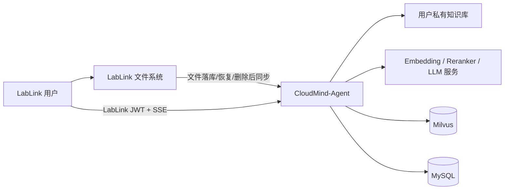
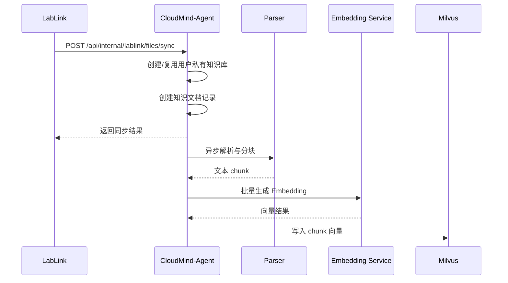
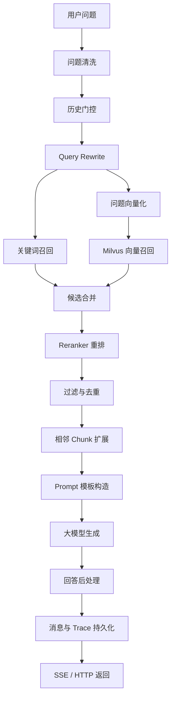

# CloudMind-Agent

> LabLink 的 Agent / 私有知识库服务侧组件。  
> 它接收 LabLink 同步来的论文、实验报告、课程资料和项目文档，完成解析、分块、向量化、混合检索和流式问答，让 LabLink 中沉淀的文件进一步变成“可检索、可追问、可追踪”的智能资料库。

[](https://openjdk.org/)
[](https://spring.io/projects/spring-boot)
[](https://baomidou.com/)
[](https://milvus.io/)
[](#rag-问答链路)

## 项目背景

LabLink 是面向实验室、课程团队和研发小组的云端文件协作后端，负责文件上传、分享、回收、对象存储和文件元数据管理。在这些场景中，用户上传的不只是普通附件，更多是论文、实验报告、技术方案、课程资料和研发文档。

如果文件只停留在“能存、能下载”的阶段，用户仍然需要手动打开文档、搜索关键词、翻阅段落并整理答案。CloudMind-Agent 的目标是在 LabLink 文件系统之上补齐 Agent 能力：

- 将 LabLink 中适合知识库处理的文档同步到用户私有知识库。
- 自动完成文档解析、文本分块、Embedding 向量化和 Milvus 入库。
- 为 LabLink 前端提供流式资料问答、历史会话和引用片段。
- 记录 RAG 执行链路，方便排查检索、Prompt 和模型生成质量问题。

因此，CloudMind-Agent 主要是 LabLink 文件协作平台的智能资料助手后端。

## 核心功能

### LabLink 集成

- 提供 LabLink 内部文件同步接口，支持文件新增、恢复和删除后的知识库同步。
- 通过 `X-Internal-Token` 保护服务间接口，避免内部同步能力暴露给普通前端。
- 支持 `pdf`、`doc`、`docx`、`txt`、`md`、`html` 等可配置文档类型过滤。
- 为每个 LabLink 用户自动创建私有知识库，隔离不同用户的资料空间。
- 支持浏览器端携带 LabLink JWT 直连 CloudMind，减少 SSE 流式问答经过 LabLink 后端代理的复杂度。

### 文档解析与入库

- 支持本地上传文件和 LabLink MinIO 文件两类内容加载方式。
- 使用 Apache Tika、PDFBox 解析文档文本，并预留 OCRmyPDF 兜底解析扫描版 PDF。
- 使用滑动窗口分块策略，将长文档切分为适合检索和 Prompt 拼接的 chunk。
- 支持异步入库任务，后台完成 Embedding 调用和 Milvus 向量写入，避免长文档阻塞请求线程。
- 维护文档解析状态、入库状态、chunk 数量和任务进度，便于前端展示处理结果。

### RAG 检索增强

- 支持向量召回、关键词召回和 Hybrid Search，兼顾语义匹配与专有名词命中。
- 接入 BGE Embedding 和 BGE Reranker 服务，提高候选片段召回与排序质量。
- 支持 `fast`、`balanced`、`quality` 三档搜索模式，前端无需直接暴露底层检索参数。
- 支持 Query Rewrite，将连续追问改写为更适合检索的独立问题。
- 支持历史门控，避免不相关的新问题被错误地混入上一轮会话上下文。
- 支持相邻 chunk 扩展、低分过滤、重复片段去重和单文档命中数量限制。

### 问答与会话

- 提供普通 RAG 问答接口和 SSE 流式 RAG 问答接口。
- 支持 LabLink Agent 侧流式聊天接口，边生成边返回 `answer_delta` 事件。
- 支持会话创建、会话列表、历史消息查询和会话删除。
- 持久化用户消息、AI 回复、引用片段和关联的 RAG Trace。
- 支持用户保存自己的 DashScope / OpenAI-compatible API Key，并按用户维度调用模型。

### 可观测与工程化

- RAG Trace 记录原始问题、改写问题、检索参数、召回片段、Prompt、模型回答、耗时和错误信息。
- Prompt 模板集中注册，当前内置 `basic-v1`、`strict-v1`、`concise-v1`、`academic-v1`。
- 统一业务响应、统一异常处理，便于前端和 LabLink 后端集成。
- 提供 `cloudmind_quant_tools` 量化脚本，用于验证解析成功率、异步入库耗时和检索效果。

## 系统定位

CloudMind-Agent 与 LabLink 的职责边界如下：

| 项目 | 主要职责 |
| --- | --- |
| LabLink | 用户、权限、文件上传、分片合并、秒传去重、MinIO 存储、分享、回收站、文件元数据 |
| CloudMind-Agent | LabLink 文件同步、私有知识库、文档解析、向量入库、混合检索、RAG 问答、会话和 Trace |

整体关系：



## 设计思路

### 1. 文件系统主流程与 Agent 能力解耦

LabLink 负责文件协作主流程，CloudMind-Agent 负责智能检索和问答能力。LabLink 在文件事务提交后再触发同步，CloudMind 同步失败不会阻塞用户上传、恢复或删除文件。

这个设计保证 LabLink 作为文件基础设施保持稳定，同时让 Agent 能力可以独立演进，例如替换 Embedding 模型、调整检索策略或扩展 Prompt 模板。

### 2. 每个 LabLink 用户拥有私有知识库

CloudMind-Agent 根据 LabLink 用户 ID 自动创建私有知识库，并把同步来的文档与该用户绑定。这样既符合个人资料空间的使用习惯，也避免不同用户之间的文档片段在检索阶段相互污染。

### 3. 文档入库异步化

文档解析、Embedding 和 Milvus 写入都可能比较耗时，尤其是论文、报告和扫描版 PDF。系统将入库流程设计为异步任务：同步接口只负责创建文档记录和提交任务，后台线程完成解析分块与向量入库。



### 4. RAG 链路可解释、可追踪

问答质量问题通常可能出在多个阶段：问题改写、召回、重排、上下文扩展、Prompt 构造或模型生成。CloudMind-Agent 使用 RAG Trace 记录一次问答的关键中间结果，便于调试“为什么没答出来”“为什么引用了错误片段”等问题。

## RAG 问答链路



## 技术栈

| 分类 | 技术 |
| --- | --- |
| 语言与框架 | Java 21, Spring Boot 4, Spring Web MVC |
| 数据访问 | MyBatis-Plus, MySQL |
| 缓存与上下文 | Redis |
| 文档解析 | Apache Tika, PDFBox, OCRmyPDF |
| 向量数据库 | Milvus |
| AI 服务 | BGE Embedding, BGE Reranker, OpenAI-compatible Chat API |
| 对象存储集成 | MinIO SDK |
| 鉴权集成 | LabLink JWT, 内部服务 Token |
| 工程能力 | 异步任务线程池, SSE, 全局异常处理, RAG Trace |

## 目录结构

```text
cloudmind-agent
├── src/main/java/com/lablink/cloudmind
│   ├── common                  # 统一响应、异常、工具类
│   ├── infrastructure          # MyBatis-Plus、线程池等基础设施
│   └── module
│       ├── ai                  # AI 服务基础配置
│       ├── chat                # 会话、消息、流式聊天
│       ├── document            # 文件存储、PDF/OCR 解析
│       ├── embedding           # Embedding 客户端与异步入库任务
│       ├── integration/lablink # LabLink 同步、JWT 校验和 Agent 浏览器接口
│       ├── knowledge           # 知识库、知识文档、文档 chunk
│       ├── llm                 # OpenAI-compatible 模型调用与用户密钥
│       ├── rag                 # 检索、问答、Prompt、Trace、过滤、改写
│       ├── reranker            # Reranker 客户端
│       ├── security            # API Key 加密配置
│       └── vector              # Milvus 向量存储
├── src/main/resources
│   └── application-example.yml # 配置样例
├── cloudmind_quant_tools       # 文档解析、入库、检索量化脚本
└── pom.xml
```

## 快速开始

### 环境要求

- JDK 21+
- Maven 3.9+
- MySQL 8+
- Redis 6+
- Milvus 2.x
- CloudMind AI Service，提供 Embedding / Reranker 接口
- 可选：OCRmyPDF、Tesseract，用于扫描版 PDF 兜底解析

### 配置

项目提供 `src/main/resources/application-example.yml` 作为配置样例。建议复制为本地配置文件，并使用环境变量管理密钥。

关键配置项包括：

```yaml
server:
  port: 8080

spring:
  datasource:
    url: jdbc:mysql://localhost:3306/cloudmind_agent?useUnicode=true&characterEncoding=utf-8&serverTimezone=Asia/Shanghai&useSSL=false
    username: root
    password: your_password

cloudmind:
  storage:
    local-root: ./data/uploads

  milvus:
    uri: http://localhost:19530
    token: root:Milvus
    collection-name: knowledge_chunk_vector
    dimension: 768

  integration:
    lablink:
      internal-token: dev-cloudmind-lablink-token
      jwt-secret: LabLinkAI#SecretKey$2026!@#
      supported-file-types:
        - pdf
        - doc
        - docx
        - txt
        - md
        - html
      minio:
        endpoint: http://localhost:9000
        access-key: your_access_key
        secret-key: your_secret_key
        bucket-name: lablink

  ai:
    service:
      base-url: http://localhost:9001
    embedding:
      model: BAAI/bge-base-zh-v1.5
      dimension: 768
      batch-size: 32
    reranker:
      model: BAAI/bge-reranker-base
      batch-size: 16
    llm:
      openai-compatible:
        base-url: https://dashscope.aliyuncs.com/compatible-mode/v1
        api-key: ${CLOUDMIND_LLM_OPENAI_COMPATIBLE_API_KEY}
        model: qwen-plus
```

### 启动

```bash
mvn clean package
mvn spring-boot:run
```

启动后可以通过测试接口确认服务状态：

```http
GET /api/test/ping
```

## API 概览

统一响应格式：

```json
{
  "code": 200,
  "msg": "操作成功",
  "data": {},
  "timestamp": "2026-05-26T10:00:00"
}
```

### LabLink 内部同步接口

| 方法 | 路径 | 说明 |
| --- | --- | --- |
| POST | `/api/internal/lablink/files/sync` | LabLink 文件同步到用户私有知识库 |
| POST | `/api/internal/lablink/files/delete-sync` | LabLink 文件删除后同步禁用知识文档 |
| POST | `/api/internal/lablink/agent/bootstrap` | 内部初始化用户 Agent 信息 |
| POST | `/api/internal/lablink/agent/llm-key` | 内部保存用户 LLM Key |

内部接口需要请求头：

```http
X-Internal-Token: <cloudmind.integration.lablink.internal-token>
```

### LabLink 浏览器 Agent 接口

| 方法 | 路径 | 说明 |
| --- | --- | --- |
| GET | `/api/lablink/agent/bootstrap` | 获取用户私有知识库、模型 Key 和默认 RAG 配置 |
| POST | `/api/lablink/agent/llm-key` | 保存用户模型 API Key |
| POST | `/api/lablink/agent/chat/stream` | LabLink Agent SSE 流式问答 |
| GET | `/api/lablink/agent/sessions` | 查询会话列表 |
| GET | `/api/lablink/agent/sessions/{sessionId}/messages` | 查询会话消息 |
| DELETE | `/api/lablink/agent/sessions/{sessionId}` | 删除会话 |
| GET | `/api/lablink/agent/traces/{traceId}` | 查询 RAG Trace 详情 |

浏览器接口需要携带 LabLink 登录 Token：

```http
Authorization: Bearer <LabLink JWT>
```

### 知识库与文档接口

| 方法 | 路径 | 说明 |
| --- | --- | --- |
| POST | `/api/knowledge-bases` | 创建知识库 |
| GET | `/api/knowledge-bases` | 分页查询知识库 |
| GET | `/api/knowledge-bases/{id}` | 查询知识库详情 |
| PUT | `/api/knowledge-bases/{id}` | 更新知识库 |
| DELETE | `/api/knowledge-bases/{id}` | 删除知识库 |
| POST | `/api/knowledge-bases/{knowledgeBaseId}/documents` | 通过已存储文件信息添加知识文档 |
| POST | `/api/knowledge-bases/{knowledgeBaseId}/documents/upload` | Multipart 上传知识文档 |
| GET | `/api/knowledge-bases/{knowledgeBaseId}/documents` | 查询知识文档列表 |
| POST | `/api/knowledge-documents/{documentId}/parse` | 解析并分块 |
| GET | `/api/knowledge-documents/{documentId}/chunks` | 查询文档 chunk |
| POST | `/api/knowledge-documents/{documentId}/ingest-async` | 提交异步向量入库任务 |
| GET | `/api/ingest-tasks/{taskId}` | 查询入库任务状态 |

### RAG 与检索接口

| 方法 | 路径 | 说明 |
| --- | --- | --- |
| POST | `/api/knowledge-bases/{knowledgeBaseId}/retrieval-test` | 检索测试 |
| POST | `/api/knowledge-bases/{knowledgeBaseId}/rag/qa` | 普通 RAG 问答 |
| POST | `/api/knowledge-bases/{knowledgeBaseId}/rag/qa/stream` | SSE 流式 RAG 问答 |
| GET | `/api/rag/prompt-templates` | 查询可用 Prompt 模板 |
| GET | `/api/rag/traces` | 分页查询 RAG Trace |
| GET | `/api/rag/traces/{traceId}` | 查询 Trace 详情 |

## 量化测试

`cloudmind_quant_tools` 目录提供 Python 脚本，用于验证 Agent 知识库链路的工程指标：

- 文档解析成功率：普通 PDF 和扫描版 PDF 混合样本的解析结果。
- OCR 兜底命中数量：统计扫描版 PDF 是否走到 OCRmyPDF 解析路径。
- 异步入库提交耗时：验证接口是否能快速返回任务 ID。
- 入库完成耗时：统计 Embedding 和 Milvus 写入的后台处理时间。
- 检索延迟与命中情况：基于固定 query set 验证召回片段、耗时和上下文数量。

示例：

```bash
python cloudmind_quant_tools/cloudmind_quant_test.py \
  --base-url http://127.0.0.1:8080 \
  retrieval-benchmark \
  --kb-id <KB_ID> \
  --queries-csv cloudmind_quant_tools/retrieval_queries_template.csv \
  --out-csv cloudmind_retrieval_result.csv
```

## 项目亮点

- 与 LabLink 文件协作平台解耦集成，文件主流程稳定，Agent 能力独立演进。
- 自动创建 LabLink 用户私有知识库，适合个人资料、课程资料和实验文档沉淀。
- 文档入库异步化，避免长文档解析和向量化阻塞用户操作。
- 使用 Hybrid Search + Reranker + 相邻 chunk 扩展，提高论文、报告类长文档的检索质量。
- 使用 Query Rewrite 和历史门控支持连续追问，同时降低跨话题误改写风险。
- SSE 流式问答与会话持久化结合，适合在 LabLink 前端构建真实可用的资料助手体验。
- RAG Trace 记录完整链路，便于定位检索质量、Prompt 设计和模型输出问题。
- 提供量化脚本验证解析、入库和检索能力，而不只停留在功能演示。

## 后续规划

- 补充数据库初始化脚本和 Docker Compose，一键启动 MySQL、Redis、Milvus 和本地 AI 服务。
- 完善 OCRmyPDF、Tesseract 依赖检查和扫描版 PDF 解析状态回传。
- 将 Prompt 模板升级为数据库配置，支持用户或团队自定义模板。
- 完善 LabLink 侧文档解析、入库状态回传，让文件列表直接展示 Agent 同步进度。
- 增加 OpenAPI / Swagger 文档，降低 LabLink 前端和第三方工具集成成本。
- 补充更完整的单元测试、集成测试和 RAG 检索评测集。

## 相关项目

- LabLink 后端：[lablink](https://github.com/mujin114032-ship-it/LabLink)
- LabLink 前端：[lablinkai-frontend](https://github.com/mujin114032-ship-it/lablinkai-frontend)

## License

当前项目用于个人学习、课程实践和工程能力展示。如需用于企业内部或商业场景，请先补充生产级密钥管理、权限审计、数据隔离、模型调用合规和许可证说明。
